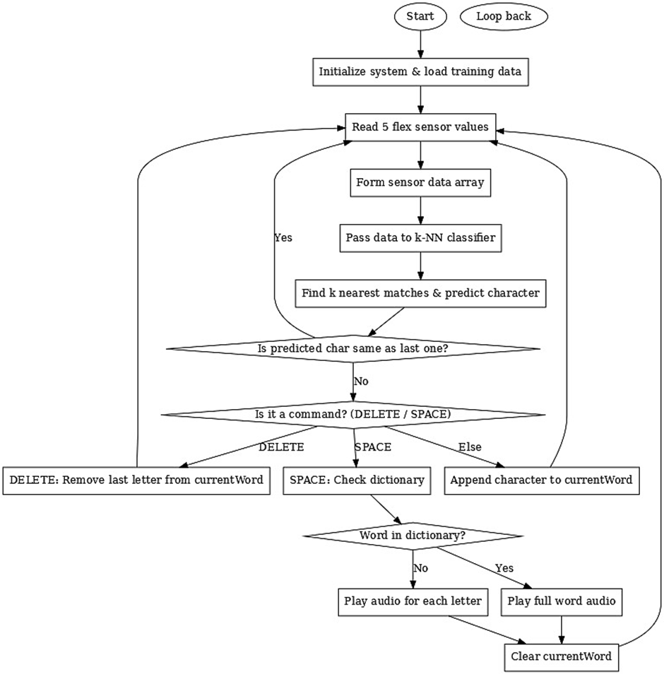

It can be very difficult for people who use sign language to talk with people who don't. This communication gap can make everyday life challenging, whether at school, at work, or just during simple conversations.
While solutions like hiring a professional interpreter exist, they are expensive and not always available. Phone apps that use a camera to recognize signs can also be tricky to use, they might not work in bad lighting, and they make you focus on a screen instead of the person in front of you.
Our project aims to fix this with a different idea: a simple, low-cost glove that translates hand signs into spoken words. We designed a unique set of signs that are very easy for the glove's sensors to read accurately. By using machine learning that trains specifically on the user's hand, our goal is to create a reliable, personal translator that is easy to carry and natural to use in any conversation.

# Hardware & Software Requirements  

## Hardware Components  

| **Hardware Component** | **Quantity** | **Purpose** |
|------------------------|-------------:|-------------|
| Arduino Uno R3 (or clone) | 1 | The central microcontroller that runs the main program logic, including the machine learning model. |
| 4.5-inch Flex Sensor | 5 | Measures the degree of bend for each finger, providing the data for recognizing gestures. |
| 10kΩ Resistor | 5 | Used with each flex sensor. |
| DFPlayer Mini MP3 Module | 1 | To convert the translated audio as an electrical signal. |
| MicroSD Card | 1 | Stores the audio files for each letter and pre-programmed word. |
| Speaker (1W, 8Ω) | 1 | The output device that converts the electrical audio signal from the DFPlayer into audible sound. |
| Fabric Glove | 1 | The base of the circuit. |
| Breadboard & Wires | 1 set | For creating the prototype circuit and connecting all components. |

---

## Software / Libraries  

| **Software / Library** | **Purpose** |
|------------------------|-------------|
| Arduino IDE | The primary environment for writing, compiling, and uploading the C code to the Arduino board. |
| DFRobotDFPlayerMini.h | An Arduino library to simplify communication and control of the DFPlayer Mini module. |
| SoftwareSerial.h | A standard Arduino library used to create an additional serial communication port for the DFPlayer. |

# Sign Language to Speech Conversion System

This project converts physical hand movements into spoken words using a glove-based sensor system. It employs a custom sign language and machine learning for real-time gesture recognition and audio feedback.

---

## Architecture

The system works through **three layers**:

### 1. Input Layer (Data Acquisition)
- Physical interface with the user.
- **Five flex sensors** mounted on the glove measure finger bends.
- Arduino's ADC converts resistance changes into numerical values (0–1023), creating a **five-dimensional data point** representing the hand state.

### 2. Processing Layer (Logic & Intelligence)
- Hosted on the **Arduino Uno**.
- Executes the main loop and the **k-Nearest Neighbors (k-NN)** classifier.
- Compares live sensor data with a pre-trained gesture library to recognize letters.
- Builds words and decides whether to play full-word audio or spell letters individually.

### 3. Output Layer (Audio Feedback)
- Sends commands to the **DFPlayer Mini** module.
- Retrieves `.mp3` files from the **microSD card**.
- Amplifies the signal and sends it to the **speaker** to produce clear, audible speech.

---

## Custom Sign Language Design

- Each sign is a unique combination of **Bent (B)** or **Straight (S)** fingers.
- With 5 fingers and 2 positions each → total combinations: \(2^5 = 32\)  
  (Thumb, Index, Middle, Ring, Pinky → T, I, M, R, P)

### Final Custom Alphabet (22 Letters)

| Char | Description | Finger State (T,I,M,R,P) |
|------|-------------|--------------------------|
| A | Only Thumb bent | B, S, S, S, S |
| B | Index, Middle, Pinky bent | S, B, B, S, B |
| C | Middle and Ring bent | S, S, B, B, S |
| D | Index and Ring bent | S, B, S, B, S |
| E | Only Index bent | S, B, S, S, S |
| F | Three outer fingers bent | S, S, B, B, B |
| G | Three middle fingers bent | S, B, B, B, S |
| H | Thumb and Pinky bent | B, S, S, S, B |
| I | Only Middle bent | S, S, B, S, S |
| K | Thumb, Ring, Pinky bent | B, S, S, B, B |
| L | Index and Pinky bent | S, B, S, S, B |
| M | Middle and Pinky bent | S, S, B, S, B |
| N | Thumb and Middle bent | B, S, B, S, S |
| O | Only Ring bent | S, S, S, B, S |
| P | Ring and Pinky bent | S, S, S, B, B |
| R | Index and Middle bent | S, B, B, S, S |
| S | Thumb and Ring bent | B, S, S, B, S |
| T | Thumb and Index bent | B, B, S, S, S |
| U | Only Pinky bent | S, S, S, S, B |
| V | Thumb, Middle, Ring bent | B, S, B, B, S |
| W | Thumb, Index, Middle bent | B, B, B, S, S |
| Y | Thumb and Pinky straight | S, B, B, B, S |

---

### Commands and Custom Words (10 Slots)

| Word/Command | Description | Finger State (T,I,M,R,P) |
|--------------|-------------|--------------------------|
| SPACE | All fingers straight (flat hand) | S, S, S, S, S |
| DELETE | All fingers bent (fist) | B, B, B, B, B |
| HELLO | Fist with thumb sticking out | B, B, B, B, S |
| THANK YOU | Pointing hand | S, B, B, B, B |
| VANAKKAM | Thumb, Middle, Pinky bent | B, S, B, S, B |
| WE | Thumb, Index, Ring bent | B, B, S, B, S |
| ARE | Index, Middle, Pinky bent | S, B, B, S, B |
| THE | Thumb, Middle, Ring bent | B, S, B, B, S |
| AMRITA | Middle finger straight, others bent | B, B, S, B, B |
| HELP | Thumb & Middle straight, others bent | S, B, S, B, B |

---

## Program Flow

1. **Sensor Reading:** Arduino reads values from the five flex sensors.  
2. **Gesture Recognition:**  
   - Values are sent to the **k-NN classifier**.  
   - k closest matches are found → majority vote → predicted character.  
3. **Character Processing:**  
   - If a new character is detected, it is processed.  
   - **Standard letters** → appended to `currentWord`.  
   - **DELETE command** → removes last letter.  
4. **Word Playback:**  
   - **SPACE command** triggers word playback.  
   - Checks if word exists in the word list → plays full word audio.  
   - If not, plays letter by letter, then resets for the next word.

---

### Process Flow Diagram

